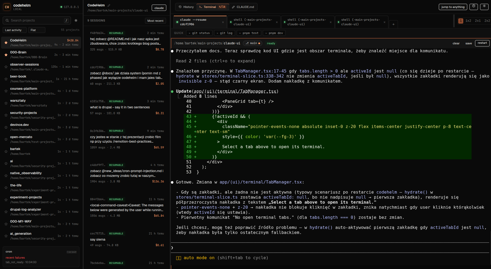
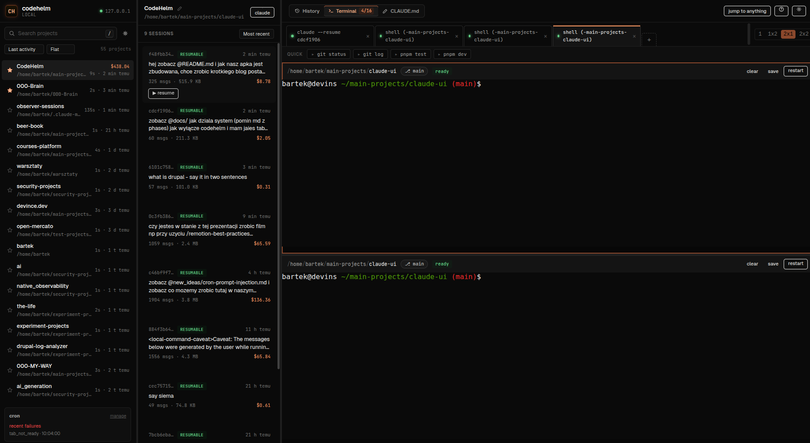
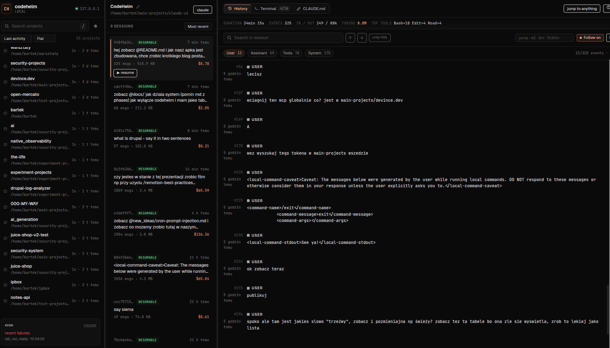
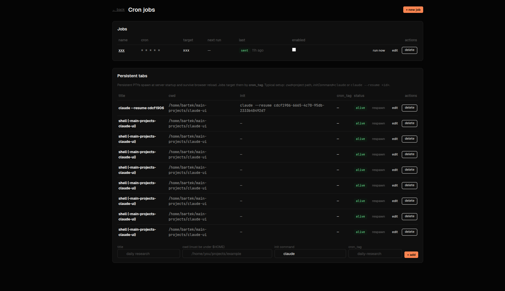

# codehelm


A local-only command center for your Claude Code CLI sessions.
One Chromium window. Every project. Every session. A real shell in
every tab. Zero cloud. Zero extra API cost. And a security model that
treats `127.0.0.1` like the attack surface it actually is.

> Built as a defense-in-depth exercise on top of Next.js 15. Eight
> phases plus a quarter of feature work on top. 564 unit + integration
> tests, 7 end-to-end specs, zero `pnpm audit` findings, one
> tightly-scoped PTY multiplexer.

---

## Quickstart

Requirements: **Node 20.11+**, **pnpm 9+**, and **Chromium** or **Google Chrome**.

### Linux (primary target — Ubuntu 22.04+ tested)

```bash
git clone https://github.com/bartek-filipiuk/codehelm.git
cd codehelm
pnpm install
pnpm build      # one-time — without this, codehelm falls back to dev mode (slower)
./bin/codehelm
```

A dedicated Chromium window opens on a random ephemeral port with a one-shot
auth token. Close the window or hit `Ctrl+C` in the terminal to tear everything
down — PTYs, watcher, and the Chromium profile are cleaned on exit.

Re-run `pnpm build` (or `./bin/codehelm --build`) whenever you pull new
source changes. Use `./bin/codehelm --dev` if you want HMR and don't mind
the slower cold start.

### macOS (verified on Darwin 25.4 arm64)

The codebase has macOS-aware helpers (`lib/server/platform.ts`) for:

- Chrome discovery at `/Applications/Google Chrome.app/Contents/MacOS/Google Chrome` and `/Applications/Chromium.app/...`
- `zsh` as the default shell (vs Linux's `bash`)
- `$TMPDIR` fallback when `$XDG_RUNTIME_DIR` is unset

```bash
git clone https://github.com/bartek-filipiuk/codehelm.git
cd codehelm
pnpm install
./bin/codehelm
```

> ✅ **Verified end-to-end on Darwin 25.4.0 (arm64), Node 22.14, pnpm 10.33, Chrome 147**
> (PR #7). `@homebridge/node-pty-prebuilt-multiarch@0.12.0` fetches the `darwin-arm64
> node-v127` prebuild — no `node-gyp` fallback. `pnpm install && pnpm build && pnpm test`
> is green (582/582) and `./bin/codehelm` hydrates the production Chrome window against
> real `~/.claude/projects` data. This closes task T25. If a future Darwin version
> reintroduces a prebuild gap, `node -e "require('@homebridge/node-pty-prebuilt-multiarch')"`
> remains the recommended smoke test.

### Windows

Run under **WSL2**. Native Windows shells are intentionally out of scope — no `conpty`
integration, no `%COMSPEC%` path handling. The WSL flow is identical to the Linux one.

### Installer (optional, one-shot)

`bin/install.ts` verifies OS + Node + pnpm, runs `pnpm install`, triggers a production
build, and drops a `~/.local/bin/codehelm` symlink:

```bash
node bin/install.ts --dry-run   # report only, no writes
node bin/install.ts             # full install + build + symlink
```

---

## Screenshots

**Full command center. Projects sidebar, session list with per-session
metadata (cost, mtime, message count), and a live `claude --resume`
terminal on the right — all in one Chromium window.**



**Split layout with a pane grid (1, 1×2, 2×1, 2×2). Up to 16 concurrent
PTYs, each with its own state, git branch badge, and persisted pane
sizes.**



**Session history viewer. Markdown, `tool_use` cards, `tool_result`
diffs for `Edit`/`Write`, search, filters, outline, virtualised — works
even on 100 MB+ sessions.**



**Scheduled prompts. Jobs bound by `cron_tag` fire into persistent tabs
(auto-respawned at startup). Ready-check + per-tab mutex keep cron out
of an in-flight Claude response.**



---

## Why it exists

Claude Code writes every session as an append-only JSONL file under
`~/.claude/projects/<slug>/<sessionId>.jsonl`. After a month of heavy use
you have fifty projects and hundreds of sessions scattered across a
directory tree you'll never open by hand. Finding "that one session where
I made Claude debug the PTY race" means `grep -r` through 800 MB of JSONL.

The CLI is great for one session at a time. It stops being great at 20.

`codehelm` is the missing front-end. It reads the JSONL you already
have, spawns PTYs via `node-pty`, watches the directory with `chokidar`,
and hands you a viewer, a multi-tab terminal, and a Markdown editor for
`CLAUDE.md`. Everything happens in-process, on `127.0.0.1`, behind a
one-shot token you never see.

---

## At a glance

| Area             | What you get                                                                                |
| ---------------- | ------------------------------------------------------------------------------------------- |
| Projects sidebar | Auto-discovery, aliases, favorites/pin, group-by-prefix, sort by activity/name/count        |
| Session list     | Preview, size, message count, relative mtime, cost estimate per session                     |
| Viewer           | Streaming JSONL, virtualised, 9 event types, search + filters, outline/minimap, stats bar   |
| Conversation UX  | Diff rendering for `Edit`/`Write` tool results, parent `tool_use` popover, replay mode      |
| Terminal         | Up to 16 concurrent PTYs, persistent across reload/restart, quick-actions row, git branch badge, clear/save buffer |
| Scheduled prompts| `/jobs` CRUD, `croner` in-process scheduler, hybrid ready-check (prompt marker OR idle > 3 s), retry on not-ready, per-job runs log, sidebar widget |
| Persistent tabs  | Server-side PTY registry auto-respawned at startup, tabs survive browser reload + `codehelm` restart, explicit close kills on server too |
| Editor           | CodeMirror 6, markdown preview split, diff-before-save, recent files dropdown, atomic write |
| Live updates     | chokidar → WebSocket → TanStack Query invalidation, toast notifications                     |
| Command UX       | Command palette (`Ctrl+K`), keyboard shortcuts overlay (`?`), jump-to-event input           |
| Settings         | Fonts, density, theme, timestamp format, default filters, model pricing — persisted JSON    |
| Auth             | Ephemeral port + 32B token + HttpOnly cookie + CSRF double-submit                           |
| CSP              | Per-request nonce, `strict-dynamic`, no `unsafe-inline` in script-src                       |
| Path traversal   | `fs.realpath` + prefix equality (fuzz-tested, 100 payloads)                                 |
| Audit log        | Whitelisted fields only, 0600 file, 0700 dir                                                |
| Platform         | Linux + macOS helpers (`lib/server/platform.ts`), `npx codehelm-install` bootstrap          |

---

## Scheduled prompts (cron)

`codehelm` can type a prompt into a long-lived Claude Code tab on a cron
schedule. The terminal remains the only surface that talks to Claude —
the scheduler just writes into its PTY as if you hit Enter yourself.

**Mental model.** You promote a terminal tab to a *persistent tab* (a PTY
registered server-side, auto-respawned at startup, identified by a stable
`cron_tag`). A *job* binds a cron expression + prompt to a `cron_tag`. At
each tick the executor resolves the target, checks whether Claude looks
idle (marker regex against the ring buffer OR `> 3 s` since last stdout),
takes a per-tab lock, and writes `ESC[200~ <prompt> ESC[201~ \r`
(bracketed paste so multiline prompts do not get split into separate
Enter presses).

**Where in the UI.**

- Sidebar widget labeled `cron` — upcoming triggers + recent failures,
  with a link to `/jobs`.
- `/jobs` page has two sections: *Jobs* (list + form) and *Persistent
  tabs* (register a new target, edit `cron_tag`, respawn dead PTYs).
- `/jobs/<id>` shows the job detail + runs log (auto-refreshes every
  5 s).

**What is stored.**

| File | Role |
| ---- | ---- |
| `~/.codehelm/persistent-tabs.json` | Persistent tab config: cwd, shell, `initCommand`, `cron_tag`, `projectSlug`, `aliasKey` |
| `~/.codehelm/jobs.json` | Jobs: cron expression, target `cron_tag`, prompt, ready-check/retry settings |
| `~/.codehelm/job-runs.jsonl` | Append-only run log, purged to last 100 entries per job every hour |
| `~/.codehelm/audit.log` | One `cron.cron_write` entry per fired prompt — no prompt body, just lengths + status |

**Safety rails.**

- `cron_tag` matches `[a-z0-9][a-z0-9_-]{0,63}`. Rejected otherwise.
- Prompt body capped at 16 KB.
- Executor takes an in-memory 60 s mutex per persistent tab before
  writing, so two jobs targeting the same tab cannot interleave.
- Ready-check can be disabled per job, but defaults to on so cron does
  not walk into the middle of another response.
- `run now` button on `/jobs` lets you fire manually without editing
  the cron expression — the happy path smoke test.

See `docs/CRON-JOBS.md` for the full subsystem layout and known
follow-ups. See `docs/PERSISTENT-TABS.md` for the persistent-tab side
(including the split-layout-on-reload rough edge, with three fix paths
sketched in cost order).

---

## Security model (stated plainly)

This application runs a login-shell PTY at the user's full privilege
level. If someone reaches the socket, they have your box. The security
model reflects that.

**Reachability**

- Listens on `127.0.0.1` only. Never `0.0.0.0`.
- Random ephemeral port chosen per run (49152–65535).
- 32-byte token from `crypto.randomBytes`, rotated on every start.
- Token rides in the launcher URL exactly once; `/api/auth` returns a
  200 HTML page with a JS redirect (instead of a 302) so the cookie
  is committed before the browser leaves the auth endpoint —
  Chromium in `--app=` mode drops Strict cookies across the boundary
  otherwise.
- `Referrer-Policy: no-referrer` globally.

**Request authentication**

- `codehelm_auth` cookie: HttpOnly, SameSite=Lax, Path=/.
- `codehelm_csrf` cookie: readable by JS, paired with an
  `x-csrf-token` header. Double-submit on every unsafe method.
- All comparisons are `crypto.timingSafeEqual`.
- WebSocket upgrade checks cookie + Origin; the first WS message must
  echo the CSRF value or the connection closes with code 1008.

**Browser hardening**

- `Host` header allowlist — only `127.0.0.1:PORT` and `localhost:PORT`
  pass. Defeats DNS rebinding even if the cookie ever leaked.
- `Origin` check on every WS upgrade.
- CSP generated per-request in `middleware.ts` with a fresh nonce.
  `script-src 'nonce-<x>' 'strict-dynamic'`. No `unsafe-inline`.
  `'unsafe-eval'` lives only in dev (Next HMR requires it); production
  builds are strict.
- `object-src 'none'`, `frame-ancestors 'none'`, `base-uri 'self'`,
  `X-Frame-Options: DENY`, `COOP/CORP: same-origin`.

**Filesystem**

- Every user-supplied path goes through `lib/security/path-guard.ts`.
  It resolves symlinks via `fs.realpath` and then enforces
  `resolved === root || resolved.startsWith(root + sep)`.
- 100 traversal payloads in unit tests: URL-encoded, double-encoded,
  null bytes, UTF-8 fullwidth dots, symlink escape, the infamous
  `/root/.claudeEVIL` prefix collision.
- `CLAUDE.md` has a stricter rule: the resolved path must be exactly
  `<dir>/CLAUDE.md`. Nothing else. No `.bak`, no nested dirs, no
  `settings.json` via alias games.

**Processes**

- `node-pty` manager caps at 16 concurrent PTYs.
- Spawn rate limit: 10 / minute (token bucket).
- Backpressure: client ACKs every 64 KB, server pauses the PTY when
  unacked traffic exceeds 1 MB. `cat huge-file` cannot OOM the server.
- `cwd` is path-guarded against `$HOME`.
- SIGHUP on tab close, SIGKILL fallback after 5 seconds.

**Audit log** (`~/.codehelm/audit.log`, `mode 0600`, dir `0700`)

Whitelisted keys only: `ts, event, sessionId, pid, cwd, shell, cols,
rows, path, bytes, writeKind`. Never env, never tokens, never content,
never `stdout`/`stderr`. The pino logger redacts `token`, `authorization`,
`cookie`, and `*.env` at emit time.

Cron writes an extra event per fired job — `cron.cron_write` with
`{jobId, persistentTabId, cronTag, promptLen, status, attempt}`. The
prompt **body** is never logged, only its length.

**Scheduled prompts**

- `cron_tag` matches `[a-z0-9][a-z0-9_-]{0,63}`; creation with any other
  shape returns 400 before the PTY is spawned.
- Prompt body capped at 16 KB (`DataMsg.max(64 * 1024)` aligned, stricter
  for the cron write path).
- The scheduler runs in-process: jobs fire only while `codehelm` is
  alive. No background daemon, no cloud callback.
- Persistent tabs count against the 16-PTY cap. The 17th spawn falls
  back to ephemeral mode.

**Resource caps**

- `PUT /api/claude-md`: 1 MB hard limit → 413.
- Rendered JSONL field in the UI: 10 MB truncate with "show more".
- Session streaming uses `ReadableStream` — the full file is never
  loaded into memory.

**Chromium profile**

- `$XDG_RUNTIME_DIR/codehelm-<uid>-<uuid>/`, `mode 0700`, tmpfs,
  auto-cleared at logout.
- Fallback to `/tmp/codehelm-<uid>-<uuid>/`, also 0700.
- Trap on `SIGTERM`/`SIGINT`/`SIGHUP` in `bin/codehelm` removes the
  profile on exit.

**Shutdown**

- `SIGTERM` kills every PTY, stops the chokidar watcher, flushes the
  audit log, closes the HTTP server. Total budget ≤ 10 seconds.

**Out of scope — stated on purpose**

- Scenarios where your account is already compromised (keylogger, Chrome
  profile exfiltrated, attacker logged in as you). There is no defense
  against a local attacker with your shell.
- Multi-user. This is a single-user tool.
- Running on a public IP. If you expose it, you own the consequences —
  at minimum put it behind Tailscale with ACLs or a reverse proxy doing
  mTLS.

Each layer above is test-covered. `pnpm audit --prod --audit-level=high`
returns zero.

---

## How the launcher works

See the [Quickstart](#quickstart) section above for install steps. The
`bin/codehelm` launcher itself will:

1. Find a free ephemeral port on `127.0.0.1`.
2. Generate a 32-byte token.
3. Spawn the Next.js server with `tsx server.ts` in the background.
4. Poll `/api/healthz` until it returns 200.
5. Create a dedicated Chromium profile under `$XDG_RUNTIME_DIR`.
6. Open `chromium --app=http://127.0.0.1:PORT/?k=TOKEN --user-data-dir=<profile>`.

`Ctrl+C` in the terminal (or closing the Chromium window) tears down
every PTY, removes the profile directory, and exits cleanly.

Environment variables:

- `CODEHELM_CHROMIUM=/path/to/chrome` — override auto-detect.
- `LOG_LEVEL=debug` — verbose pino output. Default is `info`.

---

## Architecture

```
bin/codehelm (node launcher)
  find port → gen token → spawn server → poll /healthz → spawn chromium --app
      │
      ▼
server.ts (custom http.Server, 127.0.0.1 bind)
  pipeline: Host allowlist → auth cookie → CSRF → Next handler
  upgrade:  /_next/*        → Next HMR WS
            /api/ws/pty     → lib/ws/pty-channel
            /api/ws/watch   → lib/ws/watch-channel

middleware.ts (Next edge, nonce only)
  per-request base64 nonce
  propagated via x-nonce to Next's inline scripts

lib/
├── security/    token, csrf, host-check, path-guard (realpath), csp, nonce
├── server/      config, port finder, logger (pino redact), audit,
│                middleware, singleton (globalThis-stashed singletons so
│                tsx + webpack module graphs share one instance)
├── jsonl/       Zod schemas (9 types), readline parser, listProjects,
│                slug codec, Markdown export, in-session search
├── pty/         singleton manager (cap + rate + backpressure + ring
│                buffer + isReady), spawn, audit facade,
│                persistent-tabs-{store,registry,service}, ready-check
├── cron/        jobs-store, runs-store, scheduler (croner), executor
│                (bracketed-paste write + mutex), tab-lock
├── watcher/     chokidar singleton, debounce 200ms, depth 2, no symlinks
├── ws/          upgrade router, pty-channel (Zod wire protocol + flow
│                control, spawn OR attach), watch-channel (batched push)
├── ui/          tab-aliases, pane-sizes, persistent-tab-sync
├── claude-md/   write-guard (byte-exact CLAUDE.md invariant), atomic io
└── aliases/     slug → alias map, atomic JSON write

app/
├── layout.tsx, page.tsx, PersistentTabsBootstrap.tsx (top-level hydrate)
├── (ui)/sidebar/         Search, ProjectList, CronWidget
├── (ui)/session-explorer/ SessionList, ProjectHeader (rename inline)
├── (ui)/conversation/    Viewer (virtuoso), MainPanel (mode switcher)
├── (ui)/terminal/        Terminal (xterm), TabBar, TabManager
├── (ui)/editor/          MarkdownEditor (CodeMirror 6)
├── jobs/                 /jobs page (list + CRUD), /jobs/[id] (runs log),
│                         PersistentTabsPanel, JobFormDialog
└── api/
    ├── auth, healthz
    ├── projects, projects/[slug]/sessions, projects/aliases (GET/PATCH)
    ├── sessions/[id], sessions/[id]/export, sessions/new
    ├── claude-md, claude-md/[slug]
    ├── cron/jobs (GET/POST), cron/jobs/[id] (GET/PUT/DELETE),
    │   cron/jobs/[id]/runs, cron/jobs/[id]/trigger, cron/dashboard
    └── persistent-tabs (GET/POST), persistent-tabs/[id] (PUT/DELETE/POST)

hooks/  use-projects, use-sessions, use-session-stream, use-pty, use-watch,
        use-open-session, use-claude-md, use-aliases, use-cron-jobs
stores/ ui-slice, terminal-slice (zustand)
```

---

## Design principles

- **Boundary over trust.** Every input crossing a trust boundary is
  validated, even ones from "our own" client. If you wouldn't accept
  it from a stranger, you don't accept it from yourself either.
- **Narrow the blast radius.** Caps, rate limits, and backpressure
  everywhere. A bug in the UI should not become a way to take down
  the server.
- **Audit what matters, nothing else.** The log answers "what happened"
  without leaking "what was said". Fields are whitelisted, not
  blacklisted.
- **Keep the CLI authoritative.** This is a viewer and a launcher. It
  never rewrites JSONL, never mutates session state, never invents
  its own session format. Claude Code stays the source of truth.
- **No magic.** Custom server, explicit middleware, explicit CSP.
  If a request is unauthorised, the rejection is visible in the logs
  the next second.

---

## Tests

```bash
pnpm test          # vitest unit + integration (230+ tests)
pnpm test:e2e      # playwright (18 specs across phases 0..7)
pnpm audit         # pnpm audit --prod --audit-level=high (zero)
pnpm lint          # strict eslint, bans eval/Function/dangerouslySetInnerHTML
pnpm typecheck     # tsc --noEmit
pnpm build         # Next standalone + custom server
```

What the suite actually proves:

- Path-guard survives 100 traversal payloads.
- CSRF rejects missing / tampered / replayed tokens.
- `Host: evil.com` returns 403 regardless of cookie presence.
- WS upgrade without Origin or cookie returns 403.
- PTY cap of 16 enforced; spawn rate-limit kicks in at 11/minute.
- Backpressure pauses a `yes`-flooding PTY before memory spikes.
- JSONL parser tolerates all 9 known event types and skips malformed
  lines without losing position.
- Atomic `CLAUDE.md` write keeps old content visible throughout the
  write window; `If-Unmodified-Since` mismatch returns 412.
- Chokidar ignores symlinks leaving the projects dir; bursty appends
  coalesce through the 200 ms per-file debounce.
- `<script>alert(1)</script>` in an assistant message renders as text.
  The playwright dialog listener catches zero alerts.
- End-to-end: spawn a shell, type `echo hello`, see `hello` in xterm.
  Resume a session, get `claude --resume <id>` typed for you. Append
  a JSONL line in the background, the sidebar updates without a click.

---

## Phases

Development happened in eight security-gated phases. Each tag is a
release marker with a passing gate suite.

| Tag          | Scope                                           |
| ------------ | ----------------------------------------------- |
| phase-0-done | Foundation: security primitives + launcher + CI |
| phase-1-done | Backend: JSONL parser + four REST endpoints     |
| phase-2-done | Sidebar + session explorer                      |
| phase-3-done | Conversation viewer + Shiki + sanitization      |
| phase-4-done | WebSocket + node-pty + single terminal          |
| phase-5-done | Multi-tab + `claude --resume` spawn             |
| phase-6-done | File watcher + live updates                     |
| phase-7-done | CodeMirror 6 + atomic write                     |

---

## Non-goals

This is what `codehelm` explicitly does **not** try to do:

- Send prompts through its own API as a new chat surface. The embedded
  terminal is still the prompting interface; cron jobs write into an
  existing PTY as if the user typed, they do not speak to Anthropic
  directly.
- Parse Claude's response to chain jobs or flip feature flags based on
  output. The scheduler is fire-only; output flows into the xterm buffer
  for humans (or whatever tooling is watching `~/.claude/projects/*.jsonl`).
- Sync state between machines. Run one instance per host.
- Authenticate multiple users. Single user on a trusted machine.
- Ship a mobile UI. Desktop-first.
- Replace the CLI. If `claude` changes its JSONL format, this project
  adapts — the CLI doesn't adapt to us.
- Work as a public web service. If you're reading this as a howto for
  putting it on the internet, stop.

---

## Roadmap

The full backlog lives in [IMPROVEMENTPLAN.md](IMPROVEMENTPLAN.md),
bucketed by value/cost. The active queue in [TASKS.md](TASKS.md) is
consumed by an autonomous nightly scheduler that picks the next
unchecked task, implements it under the same test discipline, commits,
and opens a PR against `main`.

Shipped since phase-7-done (T01–T29):

- Resolve-cwd fallback for legacy projects; resizable columns;
  favorites/pin; sort toggle.
- Keyboard shortcuts overlay (`?`); command palette (`Ctrl+K`);
  outline/minimap; stats bar; toast notifications.
- Settings modal (fonts, density, theme, timestamp format, default
  filters, model pricing).
- Diff rendering for tool results; markdown preview split; cost
  estimator; replay mode; jump-to-event; terminal clear/save.
- Parent `tool_use` popover; diff-before-save; recent CLAUDE.md
  dropdown; terminal quick-actions row; git branch badge.
- Project grouping by path prefix; default event-category filters.
- Cross-platform helpers (Linux + macOS) and `npx codehelm-install`
  bootstrap.
- Full English UI + docs sweep with a source-tree-wide guard test
  against Polish diacritic regressions.
- Scheduled prompts: `node-pty` ring buffer + hybrid ready-check,
  `croner`-based in-process scheduler, `/jobs` CRUD + runs log +
  dashboard widget, `cron.cron_write` audit entries.
- Persistent terminal tabs: server-side registry + auto-respawn,
  `attach` WebSocket protocol alongside `spawn`, bootstrap hydration on
  app load, rename persisted server-side per persistent tab.
- Cross-graph-safe singletons (`lib/server/singleton.ts`) so custom
  server (tsx) and Next route handlers (webpack) share one
  `ptyManager` / `persistentTabsRegistry` / cron scheduler.

Open:

- README polish + fresh banner after the `claude-ui → codehelm`
  rebrand landed.

---

## Development

```bash
pnpm dev                               # HMR dev server
pnpm exec playwright install chromium  # once
pnpm test:watch                        # vitest interactive
```

Strict TypeScript, strict ESLint with project-wide bans on `eval`,
`new Function`, and `dangerouslySetInnerHTML` fed from user data.
Prettier. Husky pre-commit. Conventional commits.

The custom `server.ts` runs alongside Next rather than replacing it —
Next owns the App Router and HMR, this server owns the HTTP pipeline
and WebSocket upgrades. Every request runs through the middleware
stack (`Host` → auth → CSRF) before Next ever sees it.

---

## License

MIT — see [LICENSE](LICENSE) when added. Until then, treat as
all-rights-reserved with permission for personal use.

---

Built for local-only use. Treat `127.0.0.1` as the trust boundary.
If you need remote access, put Tailscale in front of it or don't do it
at all. The threat model stops where the socket binds.
