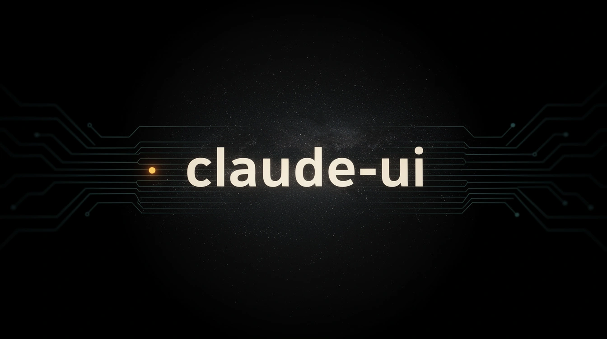
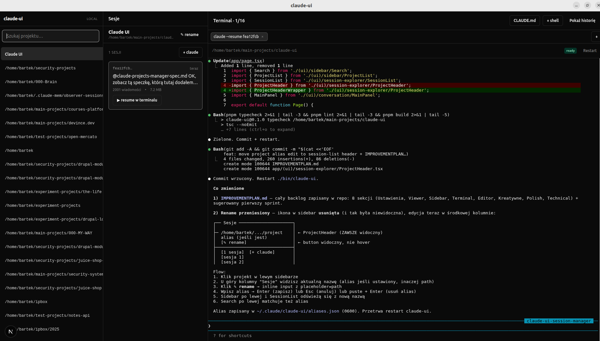
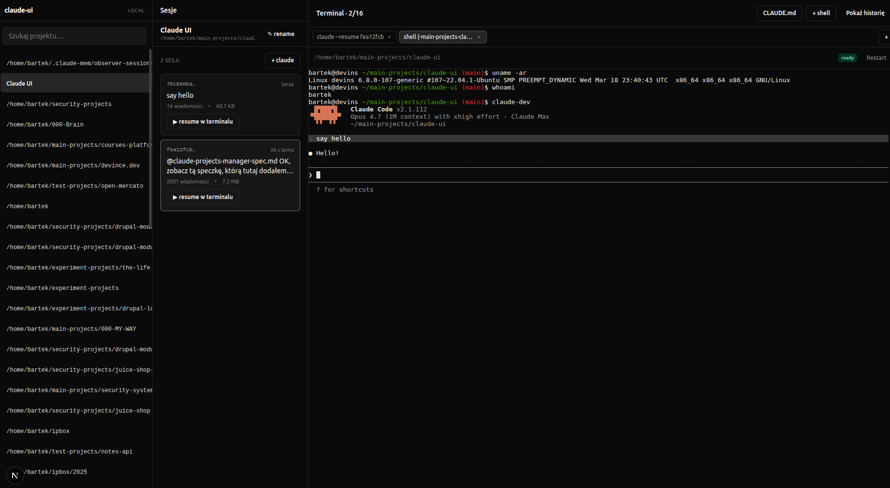
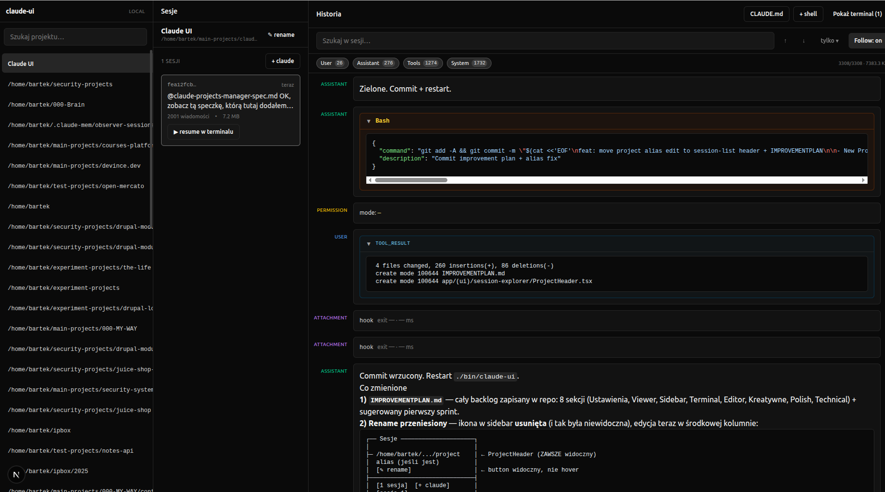

# claude-ui



A local-only command center for your Claude Code CLI sessions.
One Chromium window. Every project. Every session. A real shell in
every tab. Zero cloud. Zero extra API cost. And a security model that
treats `127.0.0.1` like the attack surface it actually is.

> Built as a defense-in-depth exercise on top of Next.js 15. Eight phases,
> 230+ unit/integration tests, 18 end-to-end specs, zero `npm audit`
> findings, one tightly-scoped PTY multiplexer.

---

## Screenshots

**Session history. Markdown, tool_use cards, tool_result with diffs, all
virtualised and searchable.**



**Multi-tab terminal. `claude --resume <id>` is one click.**



**Tool calls expand into inline, syntax-highlighted cards. No more
`[tool_use]` placeholders.**



---

## Why it exists

Claude Code writes every session as an append-only JSONL file under
`~/.claude/projects/<slug>/<sessionId>.jsonl`. After a month of heavy use
you have fifty projects and hundreds of sessions scattered across a
directory tree you'll never open by hand. Finding "that one session where
I made Claude debug the PTY race" means `grep -r` through 800 MB of JSONL.

The CLI is great for one session at a time. It stops being great at 20.

`claude-ui` is the missing front-end. It reads the JSONL you already
have, spawns PTYs via `node-pty`, watches the directory with `chokidar`,
and hands you a viewer, a multi-tab terminal, and a Markdown editor for
`CLAUDE.md`. Everything happens in-process, on `127.0.0.1`, behind a
one-shot token you never see.

---

## At a glance

| Area             | What you get                                                  |
| ---------------- | ------------------------------------------------------------- |
| Projects sidebar | Auto-discovered from `~/.claude/projects/`, aliasable, search |
| Session list     | Preview, size, message count, relative mtime                  |
| Viewer           | Streaming JSONL, virtualised, 9 event types, search + filters |
| Terminal         | Up to 16 concurrent PTYs, backpressure, SIGHUP teardown       |
| CLAUDE.md editor | CodeMirror 6, atomic write, `If-Unmodified-Since` conflict    |
| Live updates     | chokidar → WebSocket → TanStack Query invalidation            |
| Auth             | Ephemeral port + 32B token + HttpOnly cookie + CSRF           |
| CSP              | Per-request nonce, `strict-dynamic`, no `unsafe-inline`       |
| Path traversal   | `fs.realpath` + prefix equality (fuzz-tested, 100 payloads)   |
| Audit log        | Whitelisted fields only, 0600 file, 0700 dir                  |

---

## Security model (stated plainly)

This application runs a login-shell PTY at the user's full privilege
level. If someone reaches the socket, they have your box. The security
model reflects that.

**Reachability**

- Listens on `127.0.0.1` only. Never `0.0.0.0`.
- Random ephemeral port chosen per run (49152–65535).
- 32-byte token from `crypto.randomBytes`, rotated on every start.
- Token rides in the launcher URL exactly once; `/api/auth` returns a
  200 HTML page with a JS redirect (instead of a 302) so the cookie
  is committed before the browser leaves the auth endpoint —
  Chromium in `--app=` mode drops Strict cookies across the boundary
  otherwise.
- `Referrer-Policy: no-referrer` globally.

**Request authentication**

- `claude_ui_auth` cookie: HttpOnly, SameSite=Lax, Path=/.
- `claude_ui_csrf` cookie: readable by JS, paired with an
  `x-csrf-token` header. Double-submit on every unsafe method.
- All comparisons are `crypto.timingSafeEqual`.
- WebSocket upgrade checks cookie + Origin; the first WS message must
  echo the CSRF value or the connection closes with code 1008.

**Browser hardening**

- `Host` header allowlist — only `127.0.0.1:PORT` and `localhost:PORT`
  pass. Defeats DNS rebinding even if the cookie ever leaked.
- `Origin` check on every WS upgrade.
- CSP generated per-request in `middleware.ts` with a fresh nonce.
  `script-src 'nonce-<x>' 'strict-dynamic'`. No `unsafe-inline`.
  `'unsafe-eval'` lives only in dev (Next HMR requires it); production
  builds are strict.
- `object-src 'none'`, `frame-ancestors 'none'`, `base-uri 'self'`,
  `X-Frame-Options: DENY`, `COOP/CORP: same-origin`.

**Filesystem**

- Every user-supplied path goes through `lib/security/path-guard.ts`.
  It resolves symlinks via `fs.realpath` and then enforces
  `resolved === root || resolved.startsWith(root + sep)`.
- 100 traversal payloads in unit tests: URL-encoded, double-encoded,
  null bytes, UTF-8 fullwidth dots, symlink escape, the infamous
  `/root/.claudeEVIL` prefix collision.
- `CLAUDE.md` has a stricter rule: the resolved path must be exactly
  `<dir>/CLAUDE.md`. Nothing else. No `.bak`, no nested dirs, no
  `settings.json` via alias games.

**Processes**

- `node-pty` manager caps at 16 concurrent PTYs.
- Spawn rate limit: 10 / minute (token bucket).
- Backpressure: client ACKs every 64 KB, server pauses the PTY when
  unacked traffic exceeds 1 MB. `cat huge-file` cannot OOM the server.
- `cwd` is path-guarded against `$HOME`.
- SIGHUP on tab close, SIGKILL fallback after 5 seconds.

**Audit log** (`~/.claude/claude-ui/audit.log`, `mode 0600`, dir `0700`)

Whitelisted keys only: `ts, event, sessionId, pid, cwd, shell, cols,
rows, path, bytes, writeKind`. Never env, never tokens, never content,
never `stdout`/`stderr`. The pino logger redacts `token`, `authorization`,
`cookie`, and `*.env` at emit time.

**Resource caps**

- `PUT /api/claude-md`: 1 MB hard limit → 413.
- Rendered JSONL field in the UI: 10 MB truncate with "show more".
- Session streaming uses `ReadableStream` — the full file is never
  loaded into memory.

**Chromium profile**

- `$XDG_RUNTIME_DIR/claude-ui-<uid>-<uuid>/`, `mode 0700`, tmpfs,
  auto-cleared at logout.
- Fallback to `/tmp/claude-ui-<uid>-<uuid>/`, also 0700.
- Trap on `SIGTERM`/`SIGINT`/`SIGHUP` in `bin/claude-ui` removes the
  profile on exit.

**Shutdown**

- `SIGTERM` kills every PTY, stops the chokidar watcher, flushes the
  audit log, closes the HTTP server. Total budget ≤ 10 seconds.

**Out of scope — stated on purpose**

- Scenarios where your account is already compromised (keylogger, Chrome
  profile exfiltrated, attacker logged in as you). There is no defense
  against a local attacker with your shell.
- Multi-user. This is a single-user tool.
- Running on a public IP. If you expose it, you own the consequences —
  at minimum put it behind Tailscale with ACLs or a reverse proxy doing
  mTLS.

Each layer above is test-covered. `pnpm audit --prod --audit-level=high`
returns zero.

---

## Quick start

Requirements: Node 20.11+, pnpm 9+, Chromium or Google Chrome. Linux
is the primary target (Ubuntu 22.04+ tested); macOS support is being
rolled in per the `PLATFORM_I18N_PLAN.md` roadmap. On Windows run the
launcher inside WSL — the Windows-native shell is intentionally out of
scope. The UI ships in English.

```bash
git clone https://github.com/bartek-filipiuk/claude-ui.git
cd claude-ui
pnpm install
./bin/claude-ui
```

The launcher will:

1. Find a free ephemeral port on `127.0.0.1`.
2. Generate a 32-byte token.
3. Spawn the Next.js server with `tsx server.ts` in the background.
4. Poll `/api/healthz` until it returns 200.
5. Create a dedicated Chromium profile under `$XDG_RUNTIME_DIR`.
6. Open `chromium --app=http://127.0.0.1:PORT/?k=TOKEN --user-data-dir=<profile>`.

`Ctrl+C` in the terminal (or closing the Chromium window) tears down
every PTY, removes the profile directory, and exits cleanly.

Environment variables:

- `CLAUDE_UI_CHROMIUM=/path/to/chrome` — override auto-detect.
- `LOG_LEVEL=debug` — verbose pino output. Default is `info`.

---

## Architecture

```
bin/claude-ui (node launcher)
  find port → gen token → spawn server → poll /healthz → spawn chromium --app
      │
      ▼
server.ts (custom http.Server, 127.0.0.1 bind)
  pipeline: Host allowlist → auth cookie → CSRF → Next handler
  upgrade:  /_next/*        → Next HMR WS
            /api/ws/pty     → lib/ws/pty-channel
            /api/ws/watch   → lib/ws/watch-channel

middleware.ts (Next edge, nonce only)
  per-request base64 nonce
  propagated via x-nonce to Next's inline scripts

lib/
├── security/    token, csrf, host-check, path-guard (realpath), csp, nonce
├── server/      config, port finder, logger (pino redact), audit, middleware
├── jsonl/       Zod schemas (9 types), readline parser, listProjects,
│                slug codec, Markdown export, in-session search
├── pty/         singleton manager (cap + rate + backpressure), spawn,
│                audit facade
├── watcher/     chokidar singleton, debounce 200ms, depth 2, no symlinks
├── ws/          upgrade router, pty-channel (Zod wire protocol + flow
│                control), watch-channel (batched push, 100ms / 50 ev)
├── claude-md/   write-guard (byte-exact CLAUDE.md invariant), atomic io
└── aliases/     slug → alias map, atomic JSON write

app/
├── layout.tsx, page.tsx
├── (ui)/sidebar/         Search, ProjectList
├── (ui)/session-explorer/ SessionList, ProjectHeader (rename inline)
├── (ui)/conversation/    Viewer (virtuoso), MainPanel (mode switcher)
├── (ui)/terminal/        Terminal (xterm), TabBar, TabManager
├── (ui)/editor/          MarkdownEditor (CodeMirror 6)
└── api/
    ├── auth, healthz
    ├── projects, projects/[slug]/sessions, projects/aliases (GET/PATCH)
    ├── sessions/[id], sessions/[id]/export, sessions/new
    └── claude-md, claude-md/[slug]

hooks/  use-projects, use-sessions, use-session-stream, use-pty, use-watch,
        use-open-session, use-claude-md, use-aliases
stores/ ui-slice, terminal-slice (zustand)
```

---

## Design principles

- **Boundary over trust.** Every input crossing a trust boundary is
  validated, even ones from "our own" client. If you wouldn't accept
  it from a stranger, you don't accept it from yourself either.
- **Narrow the blast radius.** Caps, rate limits, and backpressure
  everywhere. A bug in the UI should not become a way to take down
  the server.
- **Audit what matters, nothing else.** The log answers "what happened"
  without leaking "what was said". Fields are whitelisted, not
  blacklisted.
- **Keep the CLI authoritative.** This is a viewer and a launcher. It
  never rewrites JSONL, never mutates session state, never invents
  its own session format. Claude Code stays the source of truth.
- **No magic.** Custom server, explicit middleware, explicit CSP.
  If a request is unauthorised, the rejection is visible in the logs
  the next second.

---

## Tests

```bash
pnpm test          # vitest unit + integration (230+ tests)
pnpm test:e2e      # playwright (18 specs across phases 0..7)
pnpm audit         # pnpm audit --prod --audit-level=high (zero)
pnpm lint          # strict eslint, bans eval/Function/dangerouslySetInnerHTML
pnpm typecheck     # tsc --noEmit
pnpm build         # Next standalone + custom server
```

What the suite actually proves:

- Path-guard survives 100 traversal payloads.
- CSRF rejects missing / tampered / replayed tokens.
- `Host: evil.com` returns 403 regardless of cookie presence.
- WS upgrade without Origin or cookie returns 403.
- PTY cap of 16 enforced; spawn rate-limit kicks in at 11/minute.
- Backpressure pauses a `yes`-flooding PTY before memory spikes.
- JSONL parser tolerates all 9 known event types and skips malformed
  lines without losing position.
- Atomic `CLAUDE.md` write keeps old content visible throughout the
  write window; `If-Unmodified-Since` mismatch returns 412.
- Chokidar ignores symlinks leaving the projects dir; bursty appends
  coalesce through the 200 ms per-file debounce.
- `<script>alert(1)</script>` in an assistant message renders as text.
  The playwright dialog listener catches zero alerts.
- End-to-end: spawn a shell, type `echo hello`, see `hello` in xterm.
  Resume a session, get `claude --resume <id>` typed for you. Append
  a JSONL line in the background, the sidebar updates without a click.

---

## Phases

Development happened in eight security-gated phases. Each tag is a
release marker with a passing gate suite.

| Tag          | Scope                                           |
| ------------ | ----------------------------------------------- |
| phase-0-done | Foundation: security primitives + launcher + CI |
| phase-1-done | Backend: JSONL parser + four REST endpoints     |
| phase-2-done | Sidebar + session explorer                      |
| phase-3-done | Conversation viewer + Shiki + sanitization      |
| phase-4-done | WebSocket + node-pty + single terminal          |
| phase-5-done | Multi-tab + `claude --resume` spawn             |
| phase-6-done | File watcher + live updates                     |
| phase-7-done | CodeMirror 6 + atomic write                     |

---

## Non-goals

This is what `claude-ui` explicitly does **not** try to do:

- Send prompts through its own API. The embedded terminal is the
  prompting interface.
- Sync state between machines. Run one instance per host.
- Authenticate multiple users. Single user on a trusted machine.
- Ship a mobile UI. Desktop-first.
- Replace the CLI. If `claude` changes its JSONL format, this project
  adapts — the CLI doesn't adapt to us.
- Work as a public web service. If you're reading this as a howto for
  putting it on the internet, stop.

---

## Roadmap

The full backlog lives in [IMPROVEMENTPLAN.md](IMPROVEMENTPLAN.md),
bucketed by value/cost. The active queue in [TASKS.md](TASKS.md) is
consumed by an autonomous nightly scheduler that picks the next
unchecked task, implements it under the same test discipline, commits,
and checks the box. See the top of that file for the protocol.

Active fronts:

- Settings modal (fonts, density, theme).
- Command palette (`Ctrl+K`) for instant project / session / action.
- Resizable columns with persistent layout.
- Session outline / minimap for long conversations.
- Diff view for `Edit` / `Write` tool results.
- Speculative: a conversation DAG, a cost estimator, a replay mode
  for post-mortems.

---

## Development

```bash
pnpm dev                               # HMR dev server
pnpm exec playwright install chromium  # once
pnpm test:watch                        # vitest interactive
```

Strict TypeScript, strict ESLint with project-wide bans on `eval`,
`new Function`, and `dangerouslySetInnerHTML` fed from user data.
Prettier. Husky pre-commit. Conventional commits.

The custom `server.ts` runs alongside Next rather than replacing it —
Next owns the App Router and HMR, this server owns the HTTP pipeline
and WebSocket upgrades. Every request runs through the middleware
stack (`Host` → auth → CSRF) before Next ever sees it.

---

## License

MIT — see [LICENSE](LICENSE) when added. Until then, treat as
all-rights-reserved with permission for personal use.

---

Built for local-only use. Treat `127.0.0.1` as the trust boundary.
If you need remote access, put Tailscale in front of it or don't do it
at all. The threat model stops where the socket binds.
